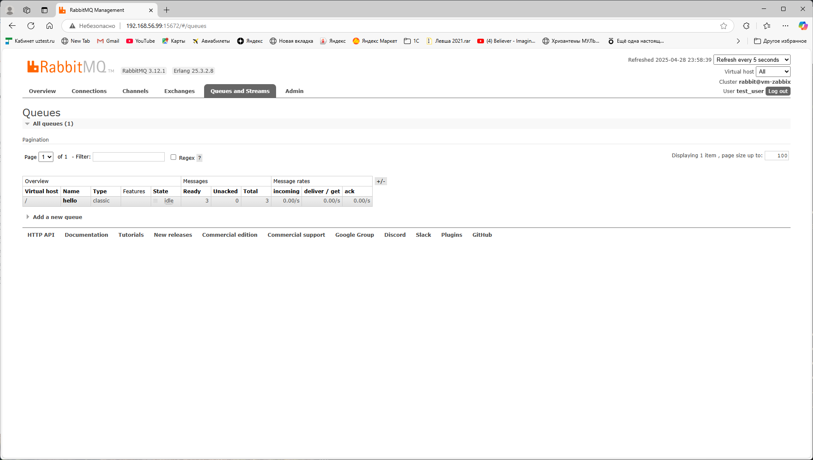

# Домашнее задание к занятию  «Очереди RabbitMQ» - Плеханов С.А.
### Задание 1. Установка RabbitMQ

Используя Vagrant или VirtualBox, создайте виртуальную машину и установите RabbitMQ.
Добавьте management plug-in и зайдите в веб-интерфейс.

*Итогом выполнения домашнего задания будет приложенный скриншот веб-интерфейса RabbitMQ.*

### Задание 2. Отправка и получение сообщений

Используя приложенные скрипты, проведите тестовую отправку и получение сообщения.
Для отправки сообщений необходимо запустить скрипт producer.py.

Зайдите в веб-интерфейс, найдите очередь под названием hello и сделайте скриншот.
После чего запустите второй скрипт consumer.py и сделайте скриншот результата выполнения скрипта

*В качестве решения домашнего задания приложите оба скриншота, сделанных на этапе выполнения.*

### Задание 3. Подготовка HA кластера

